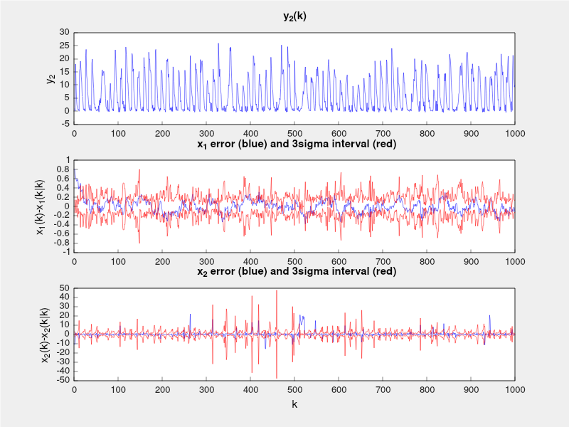
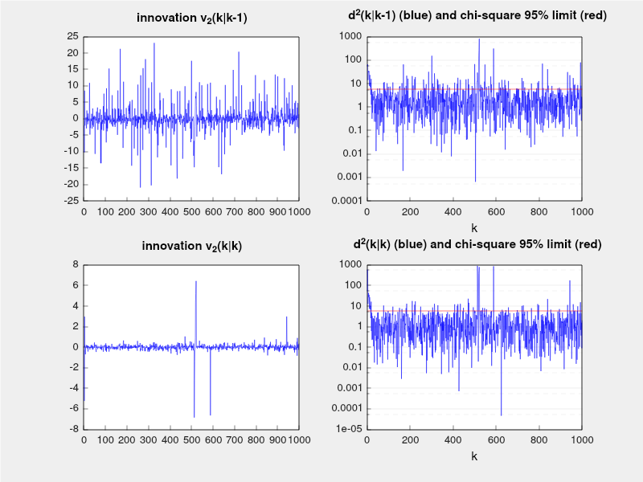
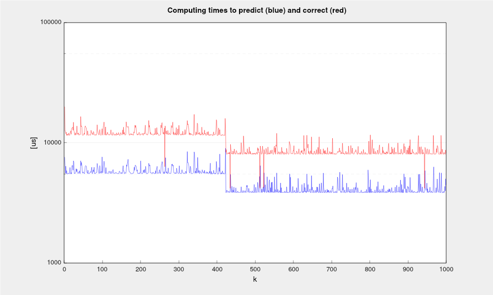
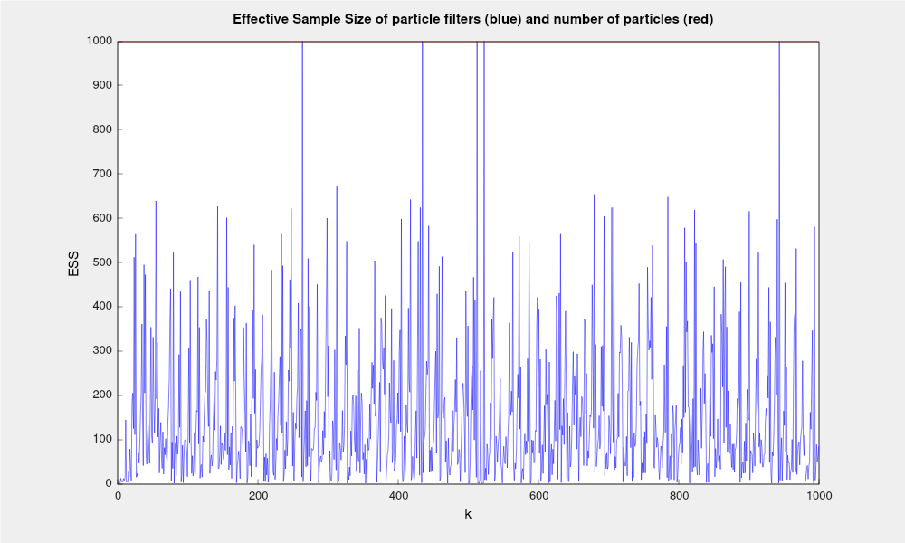

# About this library

This library is developed to be of simple use, requiring only knowledgement on Bayesian filtering and object oriented C++ programming. It is contained in a single \p bayesianfiltering.hpp file.

It deals with both time varying linear and nonlinear discrete time models. For more details, see the documentation at \p /doc folder.


# Dependencies

The library was developed with little dependence on other libraries or operating system. Some dependencies vary according to the demos provided. See the corresponding \p Readme.md file. 

## EIGEN

EIGEN is one of the most important libraries of linear algebra for C++. The Bayesian Filtering library relies strongly on it. Just install according to your system. 


## Doxygen (optional)

Doxygen is an optional installation, only if you want to update the documentation (html and/or pdf).

Installation can be done in different operational systems. See Doxygen project at https://www.doxygen.nl/

This library already has a Doxyfile configured at library root folter.

In the library root folder, run the following command:

```
$ dogygen
```


This will generate documentation in html pages (doc/html) and source files for latex/pdf version (doc/latex).

In doc/html, open index.html in any browser.

In doc/latex, in order to generate the pdf documentation just run:

```bash
$ make pdf
```
This will compile latex sources and generate \p doc/latex/refman.pdf

If latex and pdflatex are not installed in your system, install it.

For Linux, this can be accomplished by running:

```bash
$ sudo apt install texlive-latex-base
$ sudo apt install texlive-fonts-recommended texlive-latex-extra
```

Or, if you have lots of disk space, just run:

```bash
$ sudo apt install texlive-full
```

# Demos

At \p demos folder you can find the current usage examples, with folders related to the kind of platform. Explore it! They are well documented. 

For instance, Sampling Importance Resampling (SIR) particle filter demo with 1000 particles gererate the following figures:












